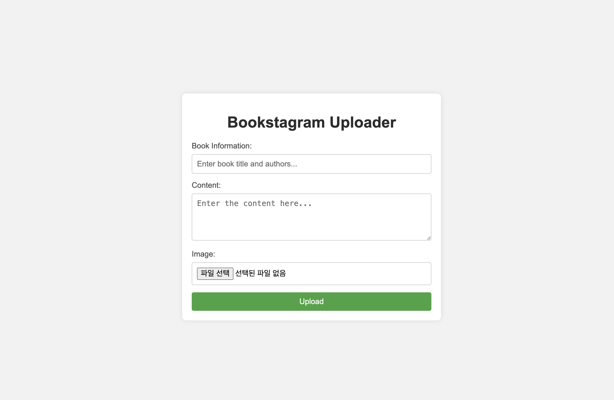

# Bookstagram Uploader


## About



Bookstagram Uploader는 북스타그램을 위해 만들어진 웹 애플리케이션입니다. 사용자가 책 정보와 콘텐츠를 입력하고 이미지를 업로드하면 이를 인스타그램에 게시합니다. 이 애플리케이션은 Flask 프레임워크를 사용하여 구축되었으며, 사용자가 업로드한 이미지를 처리하고 instagrapi를 통해 게시합니다.

## Getting Started

### Prerequisites

- Flask
- PIL (Pillow)
- Instagrapi

### Installation

1. Python 가상환경 설정
    ```bash
    python -m venv .venv
    source .venv/bin/activate  # macOS/Linux
    .venv\Scripts\activate     # Windows
    ```

2. Dependencies 설치
    ```bash
    pip install -r requirements.txt
    ```

3. `.env` 파일 생성
    - 루트 디렉토리에 `.env` 파일을 생성합니다.
    - `.env.exmaple`를 참고하여 변수를 설정합니다.

## Usage

1. 서버 실행
    ```bash
    python app.py
    ```
2. 페이지 접속
<http://127.0.0.1:5000>에 접속합니다.

3. 게시글 업로드
페이지에서 요구하는 내용을 모두 기입한 뒤 Upload 버튼을 클릭합니다.
    - Book Information: 제목, 저자
    - Content: 업로드할 책 내용
    - Image: 업로드할 이미지
